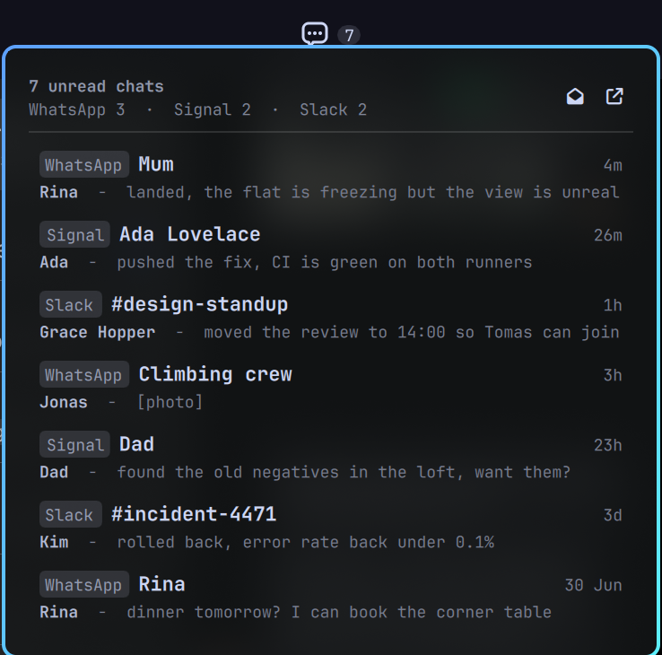

# omarchy-beeper

An Omarchy bar widget for [Beeper](https://www.beeper.com/): every unread
conversation across every network Beeper bridges — WhatsApp, Signal, Slack,
Telegram, Discord, Instagram, iMessage — in one pile. Click a row to open that
chat in Beeper Desktop and mark it read.

It is read and mark-read only. The plugin **never sends** a message, a
reaction, a draft, or an attachment.



## Requirements

- Omarchy 4.0 or newer (the plugin uses the `bar-widget` plugin kind).
- Beeper Desktop, running, with the local API enabled.
- `python3` (Omarchy ships it; no extra packages, no `sudo`, no `pkexec`).

## Install

```bash
omarchy plugin add https://github.com/prdlk/omarchy-beeper.git --enable
```

Then set up the token once, in a terminal:

```bash
~/.config/omarchy/plugins/prdlk.beeper/bin/omarchy-beeper auth
```

The prompt tells you where to get the token: **Beeper Desktop → Settings →
Integrations → create an access token** (read access is enough). Paste it at
the hidden prompt. It is stored in
`~/.config/omarchy-beeper/secrets/token.json`, mode `600`, in a `700`
directory, and is never passed on a command line.

Full walkthrough, including troubleshooting: [docs/SETUP.md](docs/SETUP.md).

Update and remove:

```bash
omarchy plugin update prdlk.beeper
omarchy plugin update prdlk.beeper --yes    # skip the prompt
omarchy plugin remove prdlk.beeper
```

Removing the plugin does **not** delete `~/.config/omarchy-beeper/`. Delete it
yourself, and revoke the token in Beeper Desktop → Settings → Integrations:

```bash
rm -rf ~/.config/omarchy-beeper
```

## Using it

| Action | What happens |
| --- | --- |
| Click the bar icon | Open or close the panel |
| Right-click the bar icon | Focus Beeper Desktop |
| Middle-click the bar icon | Refresh now |
| Click a row | Open that chat in Beeper Desktop, mark it read, close the panel |

### Keys

| Key | Action |
| --- | --- |
| `j` / `k`, `Down` / `Up` | Move the cursor |
| `Enter`, `Space`, `o` | Open the chat under the cursor |
| `a` | Mark the chat under the cursor as read, without opening it |
| `A` | Mark every unread chat as read — press twice to confirm |
| `n` / `p` | Next / previous page |
| `i` | Focus Beeper Desktop |
| `Tab` | Switch to the next bar panel |
| `Esc` | Cancel a pending mark-all, or close the panel |

### Settings

Configure these in the Omarchy bar widget settings (they live in `shell.json`):

| Key | Range | Default | Meaning |
| --- | --- | --- | --- |
| `max` | 1–50 | 25 | Rows per page |
| `refreshIntervalSec` | 15–3600 | 60 | Poll interval |

`~/.config/omarchy-beeper/config` can also carry `max=25` for CLI runs, and
`OMARCHY_BEEPER_MAX` overrides both for a single invocation.

## What counts as unread

One row is one unread **chat**, not one message, sorted newest activity first.

Not in the pile:

- **muted** chats,
- **archived** chats,
- **low-priority** chats.

A chat you marked unread by hand counts even though it has no unread
messages. If you want a muted chat to nag you, unmute it in Beeper.

The filtering happens in `lib/beeper.py`, on the `isMuted` / `isArchived` /
`isLowPriority` flags each chat carries — deliberately **not** with the search
endpoint's own filters. Measured against Beeper Desktop 4.3.73:
`includeMuted=false` returns muted chats anyway, and `inbox=primary` combined
with `unreadOnly=true` hid 77 of 78 genuinely unread chats. The per-chat flags
are exact, so the plugin asks only for `unreadOnly=true` and decides the rest
itself.

The badge counts unread chats, capped at 200 — a deeper pile is a Beeper
problem, not a bar problem. When the cap is hit the panel says so. `A`
(mark-all) is not capped at 200: it walks up to 1000 chats with a 100-second
budget and reports a partial count if it runs out.

## CLI

The panel is a thin drawing layer; everything else is `bin/omarchy-beeper`.
Every command prints exactly one JSON object and exits 0, even on failure.

```
omarchy-beeper list [--limit N] [--page OFFSET]   # the pile, newest first
omarchy-beeper read <id>                          # mark one chat read
omarchy-beeper read-all                           # mark every unread chat read
omarchy-beeper open [<id>]                        # focus Beeper, optionally a chat
omarchy-beeper auth                               # store the token (terminal only)
```

`list` emits:

```json
{
  "ok": true,
  "unread": 7,
  "accountCount": 3,
  "nextPage": "25",
  "thisPage": "0",
  "inboxes": [{ "account": "WhatsApp", "unread": 3, "searchUrl": "" }],
  "messages": [
    {
      "id": "beeper:<base64url chat id>",
      "threadId": "<chat id>",
      "subject": "<chat title>",
      "from": "<last sender>",
      "snippet": "<last message>",
      "ts": 1770804000,
      "labels": ["WhatsApp"],
      "url": ""
    }
  ]
}
```

Failures look like `{"ok":false,"error":"…"}`. The two you will actually see:

- `Beeper Desktop is not running` — start Beeper.
- `token missing or invalid; run: omarchy-beeper auth` — the token was never
  set up, or you revoked it.

## Design decisions

- **The QML layer never talks to the network.** `Panel.qml` runs the CLI and
  parses one JSON object from stdout. It never sees the token, never opens a
  socket, and renders every API string with `textFormat: Text.PlainText`.
- **Everything is bound to `http://localhost:23373`.** `lib/beeper.py` refuses
  any path outside `/v1/`, refuses any URL that would leave that origin, and
  does not follow redirects — a 3xx could point off localhost.
- **`url` is always empty.** Beeper has no web address for a chat, so opening
  one means `POST /v1/focus` with the chat id: Beeper Desktop comes forward
  with that conversation selected. There is no browser hand-off and no deep
  link to validate.
- **Snippets are index-first, one request per visible row.** The chat objects
  Beeper returns carry no message preview, so the last message comes from
  `GET /v1/messages/search?chatIDs=<chat>` — about 1 ms per chat, against
  ~145 ms for `GET /v1/chats/{chatID}/messages`, which returns a whole page.
  The slow endpoint is only used as a fallback for chats the index has not
  caught up with yet (2 of 40 on a warm install; the fallback recovered both).
  Either way only the rows on screen are fetched, never the whole pile, and a
  snippet that fails to load costs the snippet, not the row.
- **Paging is a numeric offset.** The API is cursor-based; the CLI walks the
  cursors once, caps at 200 chats, sorts, and slices. `nextPage` is the next
  offset, so `p` can step back without replaying cursors.
- **`accountCount` comes from `GET /v1/accounts`**, not from the pile, so the
  network chip appears whenever you actually have several networks connected.
- **No WebSocket.** Beeper's `ws://localhost:23373/v1/ws` is experimental and
  the panel is on a 15–3600 s poll anyway; a second event path would only add
  a way to disagree with the list. Polling only, deliberately.
- **`read-all` snapshots first.** It collects the unread chat ids before it
  marks anything, because the query it walks is defined by what is unread.

## Known Beeper limitations

- Message history can be incomplete until Beeper finishes indexing after a
  fresh install or a new bridge. Titles and unread counts are right; a snippet
  may be blank for a while.
- On-device (local) connections are the most reliable; cloud bridges can lag.
- iMessage is macOS-only. On Linux it simply never appears; there is no
  special case for it.
- Beeper Desktop must be running. The API is local and dies with the app; the
  bar icon dims to half opacity and the panel keeps the last list.

## Development

```bash
python3 -m unittest discover -s tests -t tests -v   # mocked, offline
python3 -m compileall -q lib tests
bash -n bin/omarchy-beeper
qmllint -I <shell-qml-root> Panel.qml BeeperIcon.qml
```

The tests never touch a live Beeper: `tests/support.py` fakes the HTTP opener
and serves payloads shaped like the documented API.

## License

MIT — see [LICENSE](LICENSE).
